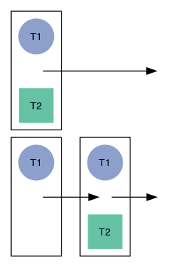
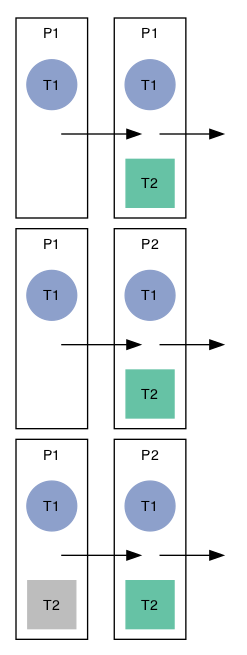

# One-Two Test Experiment

## Experiment 1

How much of a benefit is there to knowing all tests ahead of time?

## Experiment 2

How much of a cost is there to inheriting from someone else as opposed to
solving it individually?

