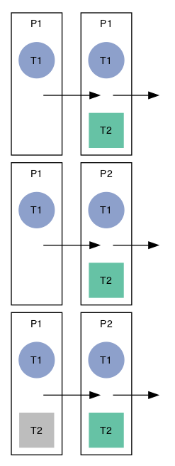

The impact of inheriting software artifacts on future problem solving
================

# Research questions

1.  How does inheriting a partial solution from someone else compare to
    solving the full problem individually?
2.  Are some languages more heritable than others?

# Methods

## Materials

Participants solved programming puzzles taken from
Exercism.io.

| exercise                                                                                                                                     | n\_test\_cases |
| :------------------------------------------------------------------------------------------------------------------------------------------- | -------------: |
| [affine-cipher](https://github.com/exercism/problem-specifications/blob/master/exercises/affine-cipher/description.md)                       |              2 |
| [allergies](https://github.com/exercism/problem-specifications/blob/master/exercises/allergies/description.md)                               |              2 |
| [atbash-cipher](https://github.com/exercism/problem-specifications/blob/master/exercises/atbash-cipher/description.md)                       |              2 |
| [beer-song](https://github.com/exercism/problem-specifications/blob/master/exercises/beer-song/description.md)                               |              2 |
| [grains](https://github.com/exercism/problem-specifications/blob/master/exercises/grains/description.md)                                     |              2 |
| [grep](https://github.com/exercism/problem-specifications/blob/master/exercises/grep/description.md)                                         |              2 |
| [kindergarten-garden](https://github.com/exercism/problem-specifications/blob/master/exercises/kindergarten-garden/description.md)           |              2 |
| [pov](https://github.com/exercism/problem-specifications/blob/master/exercises/pov/description.md)                                           |              2 |
| [queen-attack](https://github.com/exercism/problem-specifications/blob/master/exercises/queen-attack/description.md)                         |              2 |
| [rail-fence-cipher](https://github.com/exercism/problem-specifications/blob/master/exercises/rail-fence-cipher/description.md)               |              2 |
| [rest-api](https://github.com/exercism/problem-specifications/blob/master/exercises/rest-api/description.md)                                 |              2 |
| [scale-generator](https://github.com/exercism/problem-specifications/blob/master/exercises/scale-generator/description.md)                   |              2 |
| [twelve-days](https://github.com/exercism/problem-specifications/blob/master/exercises/twelve-days/description.md)                           |              2 |
| [variable-length-quantity](https://github.com/exercism/problem-specifications/blob/master/exercises/variable-length-quantity/description.md) |              2 |
| [zebra-puzzle](https://github.com/exercism/problem-specifications/blob/master/exercises/zebra-puzzle/description.md)                         |              2 |

| exercise     | test\_ix | description               |
| :----------- | -------: | :------------------------ |
| zebra-puzzle |        1 | resident who drinks water |
| zebra-puzzle |        2 | resident who owns zebra   |

## Conditions

<!-- -->
