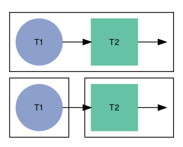

The impact of inheriting software artifacts on future problem solving
================

# Research questions

1.  How does inheriting a partial solution from someone else compare to
    solving the full problem individually?
2.  Are some languages more heritable than others?

# Methods

## Materials

Participants solved programming puzzles taken from
Exercism.io.

| exercise                                                                                                             | n\_test\_cases |
| :------------------------------------------------------------------------------------------------------------------- | -------------: |
| [beer-song](https://github.com/exercism/problem-specifications/blob/master/exercises/beer-song/description.md)       |              2 |
| [zebra-puzzle](https://github.com/exercism/problem-specifications/blob/master/exercises/zebra-puzzle/description.md) |              2 |

| exercise     | test\_ix | description               |
| :----------- | -------: | :------------------------ |
| beer-song    |        1 | single verse              |
| beer-song    |        2 | multiple verses           |
| zebra-puzzle |        1 | resident who drinks water |
| zebra-puzzle |        2 | resident who owns zebra   |

## Conditions

<!-- -->
